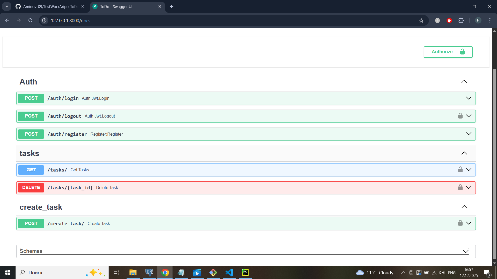
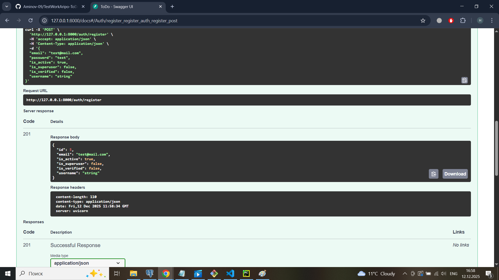
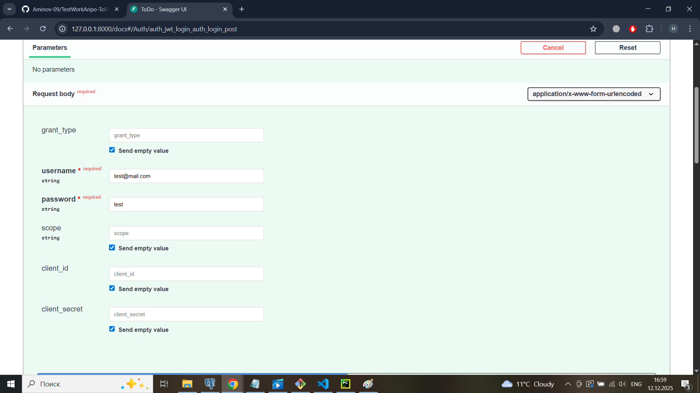
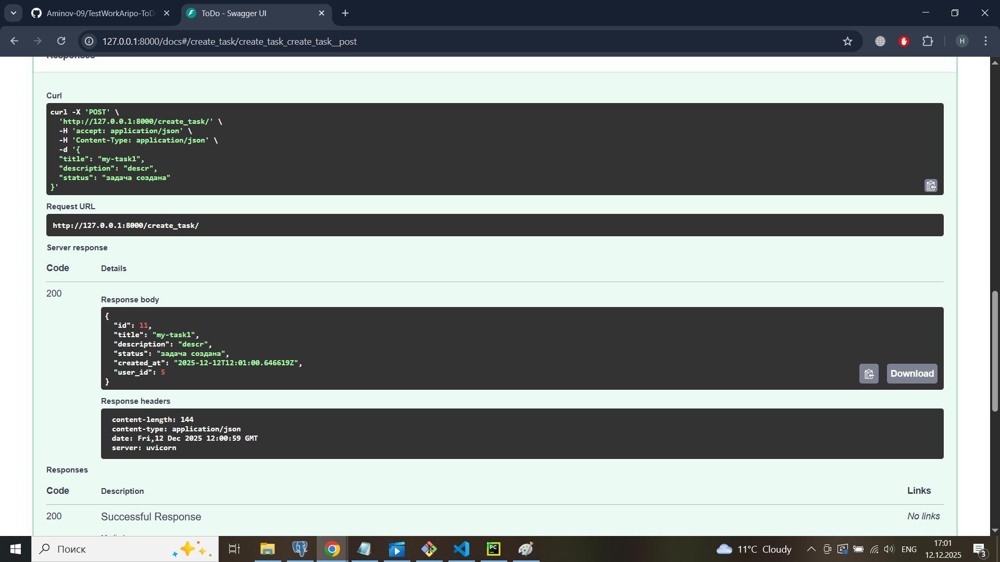
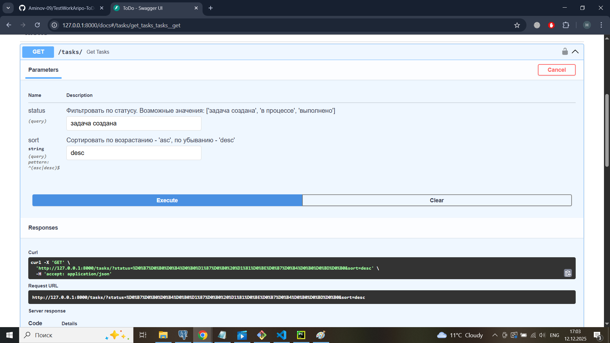
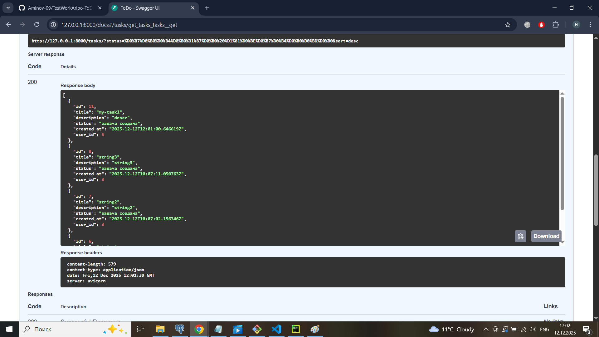
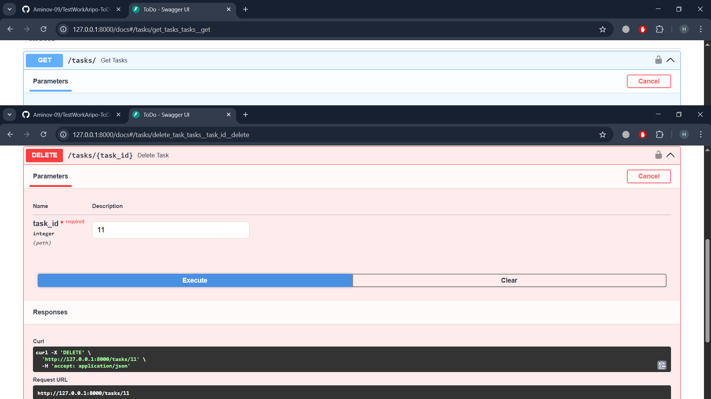
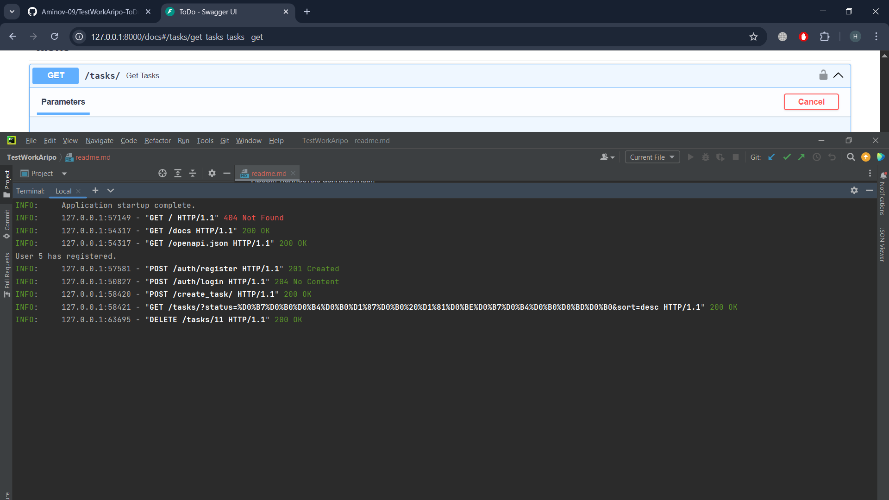
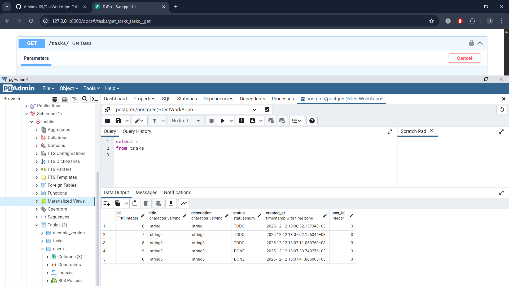
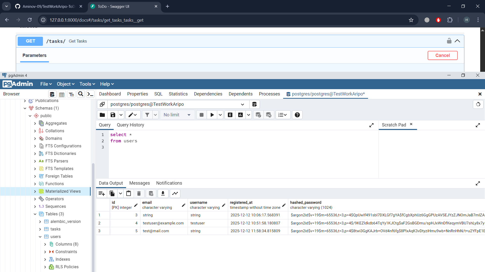

[readme.md](https://github.com/user-attachments/files/24126879/readme.md)
# ToDo

Этот проект — асинхронная система управления задачами с регистрацией, авторизацией и CRUD-функционалом для задач.  
Создан на **Python 3.11**, с использованием **FastAPI**, **fastapi-users**, **SQLAlchemy**, **PostgreSQL** и миграциями **Alembic**.

---

## 📌 Описание проекта

Реализованный функционал:

- Регистрация нового пользователя  
- Авторизация / вход  
- Выход из системы  
- Создание задач  
- Получение списка задач  
- Удаление задач  
- Все операции с задачами доступны **только авторизованным пользователям**

Проект полностью асинхронный.

---

## 🛠 Технологии

- **FastAPI**
- **fastapi-users** — аутентификация / авторизация
- **SQLAlchemy (async ORM)**
- **PostgreSQL**
- **Alembic** — миграции
- **Uvicorn** — сервер

---

## 📡 API эндпоинты
### 🔐 Авторизация
Метод	Эндпоинт	Описание

- POST	/auth/register - Регистрация
- POST	/auth/login - Вход
- POST	/auth/logout - Выход
 
### 🗂 Задачи (только для авторизованных)

Метод	Эндпоинт	Описание
- POST	/tasks - Создать задачу
- GET	/tasks - Получить список задач
- DELETE	/tasks/{task_id} - Удалить задачу

## Скриншоты
Все эндпоинты

Регистрация

Аутентификация

Создание задач

Получение задач

Задачи

Удаление задач

Логы

Таблица tasks

Таблица users

## Конец
